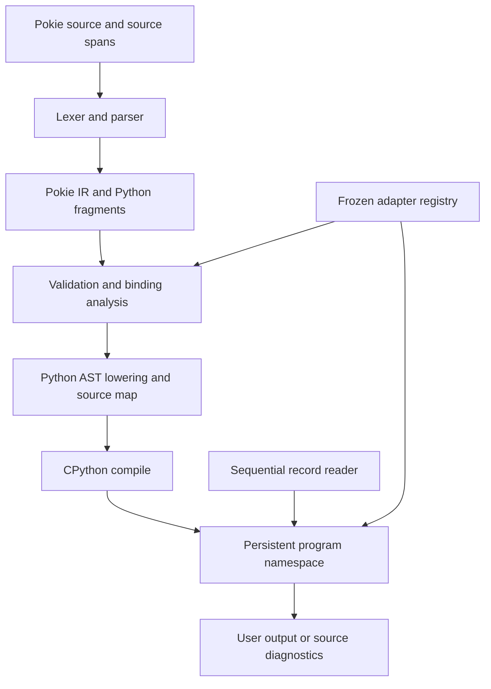

# pokie design contracts

Status: proposed v0.1. Updated: 2026-10-10. Audience: implementers and design
reviewers.

These structured artefacts precede the prose design in `docs/pokie-design.md`.
They are the canonical proposed interface shapes; implementation must either
conform or update the design and relevant ADR. They are specifications, not
executable package APIs.

## 1. Representative language contract

This proposed pokie program collects users by valid identifier, counts rejected
identifiers, and uses a Python collection. The `int` pattern is a registered
coercion adapter. `uid` becomes an integer only in an accepted case.

```text
from collections import Counter

start:
    users = {}
    rejected = Counter()

when /user=(\w+) uid=(\S+)/:
    case name, int(uid) if uid >= 0:
        users[uid] = name
    case name, bad_uid:
        rejected[bad_uid] += 1

end:
    print(len(users), sum(rejected.values()))
```

For input `user=ada uid=42`, `user=lin uid=no`, and `user=sam uid=-1`, each on
its own line, expected standard output is `1 2` followed by a newline. Rejected
candidate bindings must not overwrite existing values.

## 2. IR envelope

Coordinates use one-based lines and zero-based UTF-8 byte columns, with an
exclusive end. Adapters are resolved against a compile-time registry. Python
fragments retain source spans and parsed Python ASTs; this notation describes
types without selecting a serialization format.

```text
Span(source_id, start_line, start_byte, end_line, end_byte)
Program(preamble: PythonSuite, start: PythonSuite?,
        rules: list[Rule], end: PythonSuite?, span: Span)
Rule(predicate: Predicate, action: PythonSuite | CaseSuite, span: Span)
Predicate = Regex(source: str, flags: int) | Expression(PythonExpr)
CaseSuite(cases: list[Case])
Case(pattern: Pattern, guard: PythonExpr?, body: PythonSuite, span: Span)
Pattern = Bind(name) | Wildcard | Literal(value) | Sequence(items, star?)
        | Mapping(entries, rest?) | Alternative(items) | As(item, name)
        | Class(target, positional, keywords) | Adapter(adapter_id, inner)
Control = NextRecord(span) | ExitProgram(span)
```

Each pattern node also carries a span. `Control` nodes can occur inside rule
suites and nested loops, but not nested function or class definitions. Ordinary
Python nodes remain opaque except where lexical substitutions, binding
analysis, or control-transfer validation require inspection. Canonical capture
view selection is recursive: unwrap `As` patterns; for an `Alternative`, derive
each branch's view recursively and require all branches to agree; a mapping
root selects named groups, and any other root selects the positional tuple.
Mixed named and positional alternatives are rejected during static validation.
Alternatives must also bind the same names. For example, this proposed case
uses the named capture mapping:

```text
case {"kind": "a", "value": x} | {"kind": "b", "value": x}:
```

An alternative such as `{"kind": "a", "value": x} | ("b", x)` is rejected
because its branches require different capture views. There is no implicit
singleton unwrapping: `case int(n),:` matches one captured string through a
one-element sequence, whereas `case captures:` binds the tuple.

## 3. Adapter result and registration

```text
AdapterId = a stable registry key within one compiled program
Result[T] = Match(value: T) | NoMatch
attempt(adapter_id: AdapterId, subject: object) -> Result[object]
register(name: str, operation: Callable[[object], Result[object]]) -> AdapterId
```

`Match(None)`, `Match(False)`, and `Match(0)` are successes. `NoMatch` is a
dedicated singleton/tag, never a false-like success value. An adapter matches
one subject; its returned value is recursively matched against its inner
pattern. Failed inner matching discards that case's bindings.

The registry freezes before compilation. Duplicate registrations fail.
Qualified and unqualified adapter names are resolved explicitly; a registered
name takes adapter precedence only in pattern position. Unregistered
callable-shaped patterns retain Python class-pattern meaning. Expression calls
such as `int(text)` remain ordinary Python calls.

Initial built-in adapter candidates are:

| Name     | Accepted subject                                                           | Successful value | Rejection                                       |
| -------- | -------------------------------------------------------------------------- | ---------------- | ----------------------------------------------- |
| `digits` | Non-empty string of ASCII `0` through `9`                                  | Original string  | Other strings or types                          |
| `hexstr` | Non-empty string of ASCII hexadecimal characters, without prefix or spaces | Original string  | Other strings or types; odd lengths are allowed |
| `int`    | String accepted by Python `int(subject, 10)`                               | Python integer   | Non-string or documented conversion rejection   |
| `float`  | String accepted by Python `float(subject)`                                 | Python float     | Non-string or documented conversion rejection   |

Table 1: Proposed initial adapter catalogue.

The numeric adapters deliberately inherit Python's whitespace, sign, digit, and
floating-point rules; `float` is not a finite-number validator. Conversion
wrappers catch only the conversion's documented rejection exceptions, including
integer string-conversion limits where applicable. Unexpected exceptions
propagate. Users can build narrower adapters.

User registration syntax and discovery remain open; an implementation spike
must select a pre-compilation mechanism before custom adapters ship. The chat's
`@pattern` example is a candidate, not an implemented decorator.

## 4. Proposed CLI contract

```text
pokie [--encoding NAME] [-F SEPARATOR] PROGRAM [INPUT ...]
pokie [--encoding NAME] [-F SEPARATOR] -f PROGRAM_FILE [INPUT ...]
pokie --help
pokie --version
```

Exactly one program source is required. If no input operands are present, the
program reads standard input; `-` selects it explicitly, at most once. Other
operands name files read sequentially. Program files use UTF-8; input defaults
to UTF-8 with strict decoding. Standard output contains only user output.
Diagnostics use standard error and identify source spans or input filename or
record number.

| Outcome                                                         | Process status | `end:` behaviour                     |
| --------------------------------------------------------------- | -------------- | ------------------------------------ |
| EOF or pokie `exit`                                             | 0              | Run once if initialization succeeded |
| Usage, parsing, regex compilation, or static validation failure | 2              | Do not run                           |
| Initialization, input, guard, adapter, or action failure        | 1              | Do not run                           |
| Failure in `end:`                                               | 1              | Do not retry                         |
| Broken output pipe                                              | 1              | Stop without a secondary traceback   |

Table 2: Proposed command-line outcomes.

Pokie `exit` initially has no status argument. `SystemExit`, interruption, and
process termination retain host Python/process semantics and do not promise
`end:` execution. This distinction avoids treating `end:` as a general cleanup
facility. Python context managers provide resource cleanup.

## 5. Compiler pipeline

The pipeline separates language recognition from Python execution.



Figure 1: Proposed compiler and runtime boundaries.

The record reader delivers values to compiled code; input text never becomes
source. The registry participates in both static pattern resolution and runtime
attempts. The compiler does not create a Python frame for each rule.
