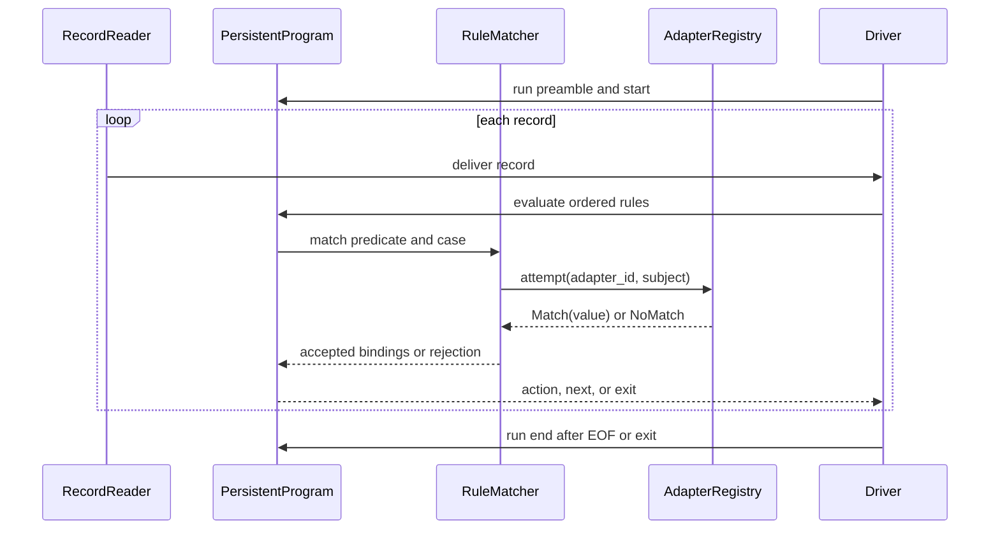

# pokie technical design

Status: proposed v0.1. Updated: 2026-10-10. Audience: implementers, reviewers,
and contributors evaluating the language.

Product scope comes from `docs/terms-of-reference.md`; terminology comes from
`docs/context.md`. Structured interface shapes in `docs/design-contracts.md`
take precedence over informal examples here. The proposed ADRs record
individual decisions. No interpreter exists yet.

## 1. Purpose, authority, and scope

Pokie combines ordered record processing with Python statements and library
calls. Regex rules produce captures; cases decide which extracted values are
useful; explicit adapters validate or convert those values. This design
addresses G1–G5 in the terms of reference without introducing a separate Python
implementation or a concurrent execution model.

The initial boundary is a trusted local program processing decoded lines
sequentially. It includes initialization, ordered rules, final output,
positional fields, capture cases, guards, and a small adapter catalogue.
Ordinary imports use the selected environment. Additional parsing formats and
performance optimizations have evidence gates in §11.

Contracts below are proposed defaults that resolve ambiguity enough to plan
implementation. They remain subject to ratification and implementation
evidence, particularly terms-of-reference Q2, Q4, and Q5. The roadmap must
update these documents when an experiment changes a contract.

## 2. Prior art and architecture decision

PAWK already combines Python line processing with begin/end actions and pattern
selection; pyawk also proposes Python as an awk alternative.[^1][^2] Pokie's
hypothesis is that structural capture dispatch and semantic adapters make
validation-heavy scripts easier to read. That hypothesis needs user evidence;
Python library support alone does not establish differentiation.

The implementation starts in Python and lowers an explicit pokie intermediate
representation (IR) to Python abstract syntax trees (ASTs). Python documents
compilation of AST objects into code objects.[^3] CPython then executes the
program. This reuses Python execution semantics and the operator's environment
while keeping pokie's extra constructs visible in a compiler-owned
representation.

| Approach                                       | Benefit                                                | Cost and disposition                                                                                          |
| ---------------------------------------------- | ------------------------------------------------------ | ------------------------------------------------------------------------------------------------------------- |
| Pokie IR to Python AST to CPython              | Structured transformations and existing Python runtime | Compiler must preserve binding and source semantics; proposed initial choice                                  |
| Text-template translation to Python            | Small first demonstration                              | Escaping, indentation, and source association become string manipulation; reject as production lowering       |
| Rust state machine with per-rule Python frames | Independent scheduling and native hot paths            | Must specify cross-frame state and Python control flow; defer until measured need                             |
| RustPython execution                           | Rust-hosted Python interpreter                         | A different interpreter creates a separate compatibility obligation; reject for initial library-reuse promise |

Table 1: Execution alternatives and their engineering trade-offs.

RustPython describes an interpreter implemented in Rust rather than CPython
bindings.[^4] That does not prove a particular package fails there. The choice
is to avoid adding another interpreter compatibility matrix before pokie
demonstrates value. Embedded CPython via Rust remains a later option; it is not
required for the initial compiler.

See [ADR 001](adr-001-cpython-ast-lowering.md),
`docs/adr-001-cpython-ast-lowering.md`.

## 3. Language and lexical contract

### 3.1. Program structure

A Python preamble precedes lifecycle blocks and rules. It can contain imports,
definitions, and assignments. There is at most one `start:` and one `end:`;
rules retain source order. Lifecycle placement is `start`, rules, then `end`.
The preamble runs once, followed by `start`, input, and normal finalization.
Reject ordinary top-level statements interleaved with rules rather than
silently moving them across execution stages.

Each `when` has either ordinary statements or an entirely case-based suite.
Reject mixing the two at the same indentation. An expression predicate uses
Python truth testing; a regex predicate uses `re.search` against `$0`. Multiple
rules can fire; there is no global first-match-wins dispatch. There is no
implicit print action or automatic creation of accumulators.

### 3.2. Lexical boundaries

Recognize pokie keywords only in their grammatical positions. After `when`, a
leading slash introduces a regex literal; otherwise parse a Python expression,
so `when total / samples > 2:` remains division. A regex closes at an unescaped
slash outside a character class. Preserve regex escapes, remove only delimiter
escaping `\/`, and initially use inline regex flags instead of inventing suffix
flags.

Recognize `$` followed by a non-negative decimal integer only in expression
positions outside strings and comments. A dedicated token-aware scanner must
recognize Python strings, bracket nesting, comments, and f-string replacement
expressions; raw search-and-replace is unsuitable. Inside an f-string, literal
text stays unchanged while a replacement expression can contain a field
reference. Invalid tokens receive original source spans.

Pass ordinary fragments to Python's parser after lexical normalization. Do not
invoke Python's `tokenize` on unmodified pokie and assume success: its
documented contract targets valid Python source.[^5] A parser-library choice
remains an implementation decision after the lexical corpus exists. Reject
unsupported syntax explicitly. Baseline syntax is CPython 3.14, matching the
scaffold; wider runtime support depends on Q2.

## 4. Record and execution semantics

### 4.1. Input and fields

One reader owns input. It opens named files sequentially and yields decoded
lines, normalizing standard text line endings and removing the terminator. A
final unterminated line is a record; an empty file has none. `$0` excludes the
line terminator and remains independent of any matched substring. `NR` counts
delivered records across all inputs, starting at one. `NF` counts fields in the
current record.

Proposed `FS` is configured in `start:` or by `-F`, then frozen before reading.
Default `FS = " "` uses whitespace splitting without empty edge fields. Other
values are non-empty literal separators; consecutive separators produce empty
fields. This intentionally narrows awk's separator surface. `-F` establishes
the initial value; `start:` can override it. Non-string or empty separators
fail initialization before input is read.

Fields, `$0`, `NF`, and `NR` are read-only. Out-of-range positive fields read as
`""`; `$0` always denotes record text. Record-only names are invalid in
`start:`; only the total `NR`, initially zero, is available in `end:`. Reject
field access inside nested definitions initially: functions that need a record
receive an explicit argument. This avoids a hidden lifetime dependency on
whichever record the loop most recently delivered.

Direct reads from the driver's input stream, including `DictReader(stdin)`, are
outside this contract. A later structured-reader interface must replace the
driver rather than compete with it. No special `stdin` object is injected for
action code.

### 4.2. State and lifecycle

Execute compiled code using one dedicated module-like globals dictionary for
preamble, lifecycle blocks, and record rules. State naturally persists, and
functions defined in the program see that namespace as their globals. This
avoids a frame per rule and avoids making preamble names function locals merely
because the compiler wrapped the program in a function.

`start:` completes before input files open. EOF and pokie `exit` run `end:`
once when initialization succeeded, including empty input. A compilation,
initialization, input, guard, adapter, or action exception stops execution
without running `end:`. Final aggregates are therefore not printed as
apparently complete results after an aborted run. Resource cleanup belongs in
context managers rather than `end:`.

The driver runs the preamble and `start:` before delivering records in order.
For each record, it evaluates rules in order; matching may invoke registered
adapters, and accepted bindings lead to an action while rejection discards
candidate bindings. External side effects are not rolled back. An action may
continue normally, skip the remaining rules with `next`, or stop normally with
`exit`. The driver runs `end:` after normal EOF or pokie `exit`; unexpected
failures skip `end:`.

**Figure 1:** Proposed record processing and lifecycle sequence.

### 4.3. Control transfer

`next` skips remaining rules for the current record. `exit` stops input
normally, closes driver-owned resources, and proceeds to `end:`. Both are bare
pokie statements, valid only inside rule actions, including user loops.
Ordinary Python `break` and `continue` retain their loop meanings. Reject them
when no user-written loop encloses the statement; the generated record loop
must not make an otherwise invalid Python statement legal.

The lowering uses compiler-owned control signals caught only at the record
driver boundary. Signals derive outside ordinary `Exception` handling; Python
`finally` blocks still run. Broad `BaseException` catches can intercept them,
so trusted programs must not suppress these signals. Reject `next` and `exit`
inside nested functions or classes and outside rules. A plain `continue` or
`break` targeted at the generated record loop would be wrong inside nested user
loops.

`SystemExit` and interruption retain Python/process semantics, without an
`end:` guarantee. See [ADR 002](adr-002-execution-scope-and-lifecycle.md),
`docs/adr-002-execution-scope-and-lifecycle.md`.

## 5. Capture and structural-pattern semantics

Regex rules keep the first `re.search` result for that record. Positional cases
receive `match.groups()`; mapping cases receive `match.groupdict()`. An explicit
`MATCH` rule-local binding exposes the regex match object, including
`MATCH.group(0)`, and is unavailable outside that rule. It is read-only and
reserved, so it cannot overwrite a user's accumulator.

Named groups also occupy positions in the group tuple. Nonparticipating
optional groups become `None`; no capture groups produce `()`. Repeated groups
retain Python regex's last-capture behaviour.[^6] A zero-length match is
successful. Use `case ():` for an empty capture tuple, never `case:`.

Ordinary expression rules may contain actions but not capture case suites. Case
patterns include literals, captures, wildcards, sequences with one star,
mappings, alternatives, `as`, and class patterns. Their ordinary structural
meaning follows Python, with adapter and binding-transaction extensions defined
here.[^7] A named-view mapping ignores extra keys unless its pattern binds a
remainder. Alternative branches use the same view and bind the same names;
reject inconsistent alternatives statically.

Try cases in source order and execute the first with a successful pattern and
guard. If none accepts, that rule has no action; later rules still run.
Candidate names remain private until the guard succeeds. Rejected patterns or
false guards leave prior program bindings unchanged. Accepted bindings persist
after the case action, like other program state.

Guards evaluate in a generated scope receiving candidates as parameters and
program state as globals. Reject assignment expressions in guards initially,
avoiding ambiguous assignment visibility. Guard exceptions propagate. Adapter
and guard side effects on external objects are not rolled back; transactional
binding does not promise reversible Python.

A name pattern matches `None` too. Put `case name, None:` before
`case name, value:` when handling an optional capture specially. Python's
syntactic irrefutability rule does not classify sequence patterns as
irrefutable. A known regex capture count may justify an additional warning
about provably unreachable later cases; keep that analysis separate.[^7]

## 6. Adapter protocol and initial catalogue

`docs/design-contracts.md` §3 defines `Match(value) | NoMatch`, registration,
and the initial `digits`, `hexstr`, `int`, and `float` candidates. A predicate
preserves its subject; a coercion returns a new value. A successful adapter
result is recursively matched against its inner pattern, so `int(0)` can
recognize an integer zero without binding it.

Resolve registered names in pattern position against a registry frozen before
compilation. They take precedence over class-pattern interpretation only there;
expression calls remain Python. Unregistered class patterns delegate to
Python's structural rules. Rebinding an expression name later does not change a
compiled adapter identity. The compiler diagnoses duplicate registrations and
retains adapter identities in the IR.

Only declared input rejection becomes `NoMatch`. Built-in wrappers catch the
documented conversion errors, never every exception. Python's integer and float
constructors define the selected conversions; their acceptance is broader than
`digits`, including signs and whitespace.[^8] An extension bug must remain an
error rather than silently rejecting data.

Custom adapter registration must happen before compiling patterns. Executing an
arbitrary program preamble to discover adapters would run user code before
validation, and therefore violates the compilation boundary. Choose an explicit
registration API or manifest through Q4's spike; defer in-program `@pattern`
syntax until that phase-ordering problem is solved.

See [ADR 003](adr-003-pattern-adapter-resolution.md),
`docs/adr-003-pattern-adapter-resolution.md`.

## 7. Compilation and runtime boundaries

The validated pipeline in `docs/design-contracts.md` §5 separates scanning,
parsing, validation, lowering, compilation, and execution. The parser preserves
original coordinates while Python fragments use normalized source.
Normalization therefore needs a reversible coordinate map; replacing `$1` with
a longer expression must not shift diagnostic columns invisibly.

The compiler validates lifecycle order, pattern bindings, view consistency,
reserved names, registry resolution, and control-transfer placement before
running the preamble. It compiles regex literals before execution. Python's
parser and compiler validate ordinary syntax and scope constraints; building an
AST is not sufficient evidence that `compile()` will accept it.[^3]

Runtime helpers own records, matching, adapters, control signals, and
diagnostic translation. Reuse existing equivalents before introducing a helper.
Helpers belong only to pokie compilation/execution, not a general parsing
framework. Their eventual public interfaces require the canonical contract and
developer-guide updates. An IR evaluator is a verification oracle, not a second
production VM.

Reserve the `__pokie_` identifier prefix, including definitions and imports,
and reject user access to it during static analysis. Generated names are unique
within a compilation. Normal Python introspection can still observe
implementation details; this is hygiene, not an isolation boundary.

Populate AST locations and maintain a separate source map for generated helpers
and normalized expressions. Diagnostics must distinguish original user spans
from compiler-generated operations. Preserve chained exceptions and underlying
library frames where useful, while leading with the pokie filename, line, and
input context. Avoid persisting compiled artefacts initially: Python AST and
bytecode compatibility add versioning obligations.

## 8. CLI, distribution, and library compatibility

`docs/design-contracts.md` §4 defines the proposed command-line interface
(CLI), input modes, encoding, diagnostics, and statuses. Parse and validate the
complete program before opening input or producing user output. Usage errors
are distinct from runtime failures. Output from Python `print` is the program's
output; the runtime adds no banner or implicit records.

The initial distribution candidate is a Python package and console entry point
installed into the same environment as libraries used by programs. That avoids
an isolated tool environment silently hiding those libraries. Ratify supported
versions, platforms, package metadata, and installation instructions through Q2
before claiming installability. The scaffold's `hello()` is not the language
CLI and must not be advertised as one.

Compatibility means the documented CPython/environment matrix, not a claim that
every import works. Standard-library imports and selected third-party
pure-Python and native-extension imports must be exercised from installed
artefacts. A clean wheel installation must include runtime resources and the
command entry point, not depend on the source checkout.

## 9. Failure and trust model

Programs and adapters are trusted code with ordinary Python access to files,
networks, imports, and process state. Input records are data; the compiler
never interpolates record values into source or calls `eval` on input. This
protects the language boundary without pretending to sandbox programs.

Compile-time failures include malformed pokie syntax, invalid regexes, illegal
bindings, and unsupported constructs. Runtime failures include decoding, file
access, user code, guard exceptions, adapter bugs, and output errors. The CLI
outcome table specifies whether finalization runs. Preserve already emitted
output on failure and return a non-zero status; do not attempt an output
rollback.

Python regexes have no promised execution deadline here. Hostile patterns,
large records, or accumulating user state can consume unbounded resources.
Changing the regex engine can change accepted syntax and matching results;
acceleration must preserve the contract or require a language decision.
Library-dependent crashes and external side effects remain outside compiler
correctness guarantees.

## 10. Verification and performance evidence

Use a simple IR evaluator and AST execution as separate paths for bounded
differential checking. Compare output, selected rules/cases, accepted bindings,
counters, and failure category. Sharing the matcher would hide matcher defects,
so pattern checks also use direct reference examples and Python structural
matching for the overlapping subset.

| Property               | Verification decision                                                                                                               | Boundary left unchecked                             |
| ---------------------- | ----------------------------------------------------------------------------------------------------------------------------------- | --------------------------------------------------- |
| Ordered rules          | Generate small predicate/action programs and records with Hypothesis; compare traces against the evaluator                          | Arbitrary external side effects                     |
| Binding isolation      | Generate nested sequences, alternatives, adapter rejections, and false guards; seed previous bindings and assert exact preservation | Mutations performed inside guards/adapters          |
| Capture fidelity       | Generate optional, named, empty, and repeated captures; compare views against Python `re`                                           | Behaviour of a replacement regex engine             |
| Lifecycle and control  | Enumerate EOF, empty input, `next`, `exit`, nested loops, failures, and `finally`; compare event traces                             | Forced process death and suppressed control signals |
| Source fidelity        | Generate Unicode and multiline fragments, including f-strings and lexical decoys; validate original diagnostic spans                | Arbitrary third-party traceback formatting          |
| Data/source separation | Vary input with pokie/Python-looking strings and confirm compiler artefacts are unchanged                                           | Programs intentionally executing input themselves   |

Table 2: Named invariants, evidence methods, and limits.

Generators use bounded valid IR and independent source fixtures, with shrinking
that retains lifecycle order and pattern binding validity. Retain minimized
counterexamples. Small generated ASTs need compilation as well as parsing.
Sampling is not a proof of all Python behaviour; no formal theorem-prover
commitment is made for the initial scope.

Integration coverage includes inline/file programs, standard input/named files,
default/custom separators, ASCII/Unicode, direct/case actions,
successful/rejected/throwing adapters, and imports. Use pairwise coverage for
the broad CLI matrix, plus mandatory higher-order cases: nested-loop `next` with
`finally`; rejected adapter then guarded fallback; named optional capture then
mapping case; Unicode field expression in an f-string error; input failure
after output; and native-extension import from a wheel. Pairwise coverage alone
does not cover those semantic risks.

Performance probes compare equivalent pokie, Python, and awk programs on
declared input sizes, record lengths, match rates, and accumulation modes.
Report throughput and peak memory separately. Without accumulating user state,
reader/runtime retention must depend on the current record and fixed program
state, not record count. No speed target exists yet; profile before selecting a
native optimization or advertising a speed advantage.

## 11. Deferred scope and open decisions

| Candidate                                                                           | Evidence required before promotion                                              |
| ----------------------------------------------------------------------------------- | ------------------------------------------------------------------------------- |
| Range predicates                                                                    | Inclusive start/end behaviour and same-record transition corpus                 |
| CSV/structured iterators                                                            | Single-owner input contract and concrete user jobs                              |
| Mutable fields or record rewriting                                                  | Resplitting, `NF`, `$0`, and downstream rule consistency contract               |
| `uuid`, `isodate`, `ip4addr`/`ipv4addr`, `base64`, `ninumber`, `scinot`, and `isbn` | Needed representation, strictness, canonical names, rejection rules, and demand |
| `rot13` and transformation patterns                                                 | Explicit treatment of unconditional matches and reachability                    |
| `&`, negation, and richer pattern composition                                       | Compatible binding and evaluation-order algebra                                 |
| Automatic parallelization                                                           | Effect/ordering model and workloads where benefit exceeds restrictions          |
| Rust reader, regex acceleration, or embedded CPython                                | Profiles, semantic equivalence checks, and distribution-cost evidence           |
| `pokie nibble`                                                                      | Dependency isolation and reproducibility need unmet by Python tools             |

Table 3: Deferred candidates and promotion gates.

Terms-of-reference Q2, Q4, Q5, and Q7 remain the principal release decisions:
compatibility/distribution, extension registration, semantic ratification, and
success thresholds. `docs/roadmap.md` makes those gates explicit.

## References

All external technical sources below were accessed on 2026-10-09. The
user-supplied transcript is cited in `docs/terms-of-reference.md`.

[^1]: [PAWK primary repository](https://github.com/alecthomas/pawk).
[^2]: [pyawk primary repository](https://github.com/RussellLuo/pyawk).
[^3]: [Python 3.14 AST documentation](https://docs.python.org/3.14/library/ast.html).
[^4]: [RustPython primary repository](https://github.com/RustPython/RustPython).
[^5]: [Python tokenizer contract](https://docs.python.org/3.14/library/tokenize.html).
[^6]: [Python regex match objects](https://docs.python.org/3.14/library/re.html#match-objects).
[^7]: [Python structural matching](https://docs.python.org/3.14/reference/compound_stmts.html#the-match-statement).
[^8]: [Python numeric constructors](https://docs.python.org/3.14/library/functions.html#int).
